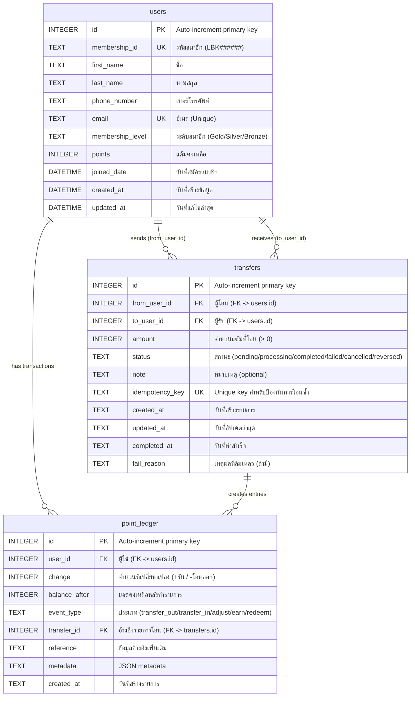
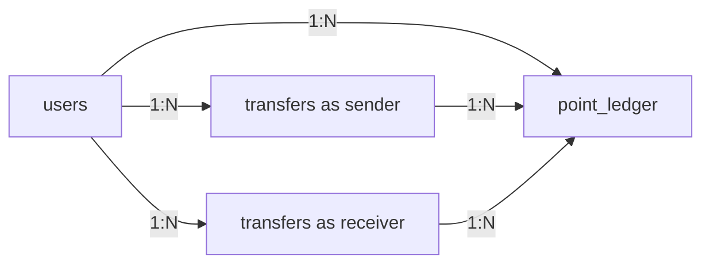
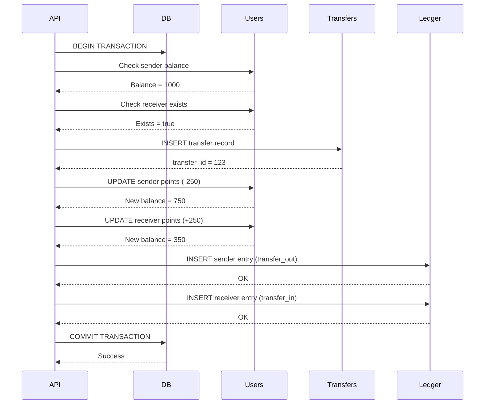

# Database Documentation

## Overview

ฐานข้อมูลของระบบ KBTG Backend API ประกอบด้วย 3 ตารางหลัก:

- **users** - เก็บข้อมูลผู้ใช้และสมาชิก
- **transfers** - เก็บรายการโอนแต้มระหว่างผู้ใช้
- **point_ledger** - สมุดบัญชีบันทึกการเปลี่ยนแปลงแต้มทุกครั้ง (Audit Trail)

## Entity Relationship Diagram



## Table Details

### 1. users Table

**Purpose**: เก็บข้อมูลผู้ใช้และข้อมูลสมาชิก

**Columns:**

| Column             | Type     | Constraints                | Description                      |
| ------------------ | -------- | -------------------------- | -------------------------------- |
| `id`               | INTEGER  | PRIMARY KEY, AUTOINCREMENT | ID อัตโนมัติ                     |
| `membership_id`    | TEXT     | UNIQUE, NOT NULL           | รหัสสมาชิก (เช่น LBK001234)      |
| `first_name`       | TEXT     | NOT NULL                   | ชื่อ                             |
| `last_name`        | TEXT     | NOT NULL                   | นามสกุล                          |
| `phone_number`     | TEXT     | NOT NULL                   | เบอร์โทรศัพท์                    |
| `email`            | TEXT     | UNIQUE, NOT NULL           | อีเมล                            |
| `membership_level` | TEXT     | DEFAULT 'Bronze'           | ระดับสมาชิก (Gold/Silver/Bronze) |
| `points`           | INTEGER  | DEFAULT 0                  | แต้มคงเหลือ                      |
| `joined_date`      | DATETIME | DEFAULT CURRENT_TIMESTAMP  | วันที่สมัครสมาชิก                |
| `created_at`       | DATETIME | DEFAULT CURRENT_TIMESTAMP  | วันที่สร้างข้อมูล                |
| `updated_at`       | DATETIME | DEFAULT CURRENT_TIMESTAMP  | วันที่แก้ไขล่าสุด                |

**Indexes:**

- PRIMARY KEY on `id`
- UNIQUE constraint on `membership_id`
- UNIQUE constraint on `email`

**Sample Data:**

```sql
INSERT INTO users (membership_id, first_name, last_name, phone_number, email, membership_level, points, joined_date)
VALUES
  ('LBK001234', 'สมชาย', 'ใจดี', '081-234-5678', 'somchai@example.com', 'Gold', 15420, '2023-06-15'),
  ('LBK001235', 'สมหญิง', 'รักดี', '082-345-6789', 'somying@example.com', 'Silver', 8500, '2023-07-20'),
  ('LBK001236', 'สมศักดิ์', 'มีสุข', '083-456-7890', 'somsak@example.com', 'Bronze', 2100, '2023-08-10');
```

---

### 2. transfers Table

**Purpose**: เก็บคำสั่งโอนแต้มระหว่างผู้ใช้

**Columns:**

| Column            | Type    | Constraints                  | Description                   |
| ----------------- | ------- | ---------------------------- | ----------------------------- |
| `id`              | INTEGER | PRIMARY KEY, AUTOINCREMENT   | ID ภายในระบบ                  |
| `from_user_id`    | INTEGER | NOT NULL, FOREIGN KEY        | ผู้โอนแต้ม (อ้างอิง users.id) |
| `to_user_id`      | INTEGER | NOT NULL, FOREIGN KEY        | ผู้รับแต้ม (อ้างอิง users.id) |
| `amount`          | INTEGER | NOT NULL, CHECK (amount > 0) | จำนวนแต้มที่โอน (ต้อง > 0)    |
| `status`          | TEXT    | NOT NULL, CHECK              | สถานะการโอน                   |
| `note`            | TEXT    | NULL                         | หมายเหตุ (optional)           |
| `idempotency_key` | TEXT    | UNIQUE, NOT NULL             | UUID สำหรับป้องกันการโอนซ้ำ   |
| `created_at`      | TEXT    | NOT NULL                     | วันที่สร้างรายการ (RFC3339)   |
| `updated_at`      | TEXT    | NOT NULL                     | วันที่อัปเดตล่าสุด (RFC3339)  |
| `completed_at`    | TEXT    | NULL                         | วันที่ทำสำเร็จ (RFC3339)      |
| `fail_reason`     | TEXT    | NULL                         | เหตุผลที่ล้มเหลว              |

**Status Values:**

- `pending` - รอดำเนินการ
- `processing` - กำลังดำเนินการ
- `completed` - สำเร็จ
- `failed` - ล้มเหลว
- `cancelled` - ยกเลิก
- `reversed` - ย้อนกลับ

**Indexes:**

- PRIMARY KEY on `id`
- UNIQUE constraint on `idempotency_key`
- INDEX on `from_user_id` (idx_transfers_from)
- INDEX on `to_user_id` (idx_transfers_to)
- INDEX on `created_at` (idx_transfers_created)

**Foreign Keys:**

- `from_user_id` REFERENCES `users(id)`
- `to_user_id` REFERENCES `users(id)`

**Business Rules:**

1. ไม่สามารถโอนแต้มให้ตัวเองได้ (`from_user_id` ≠ `to_user_id`)
2. ผู้โอนต้องมีแต้มเพียงพอ (points >= amount)
3. ทุกการโอนใช้ Database Transaction
4. idempotency_key เป็น UUID ที่ unique

---

### 3. point_ledger Table

**Purpose**: สมุดบัญชีบันทึกการเปลี่ยนแปลงแต้มทุกครั้ง (Append-only, Audit Trail)

**Columns:**

| Column          | Type    | Constraints                | Description                             |
| --------------- | ------- | -------------------------- | --------------------------------------- |
| `id`            | INTEGER | PRIMARY KEY, AUTOINCREMENT | ID ภายในระบบ                            |
| `user_id`       | INTEGER | NOT NULL, FOREIGN KEY      | ผู้ใช้ (อ้างอิง users.id)               |
| `change`        | INTEGER | NOT NULL                   | จำนวนที่เปลี่ยนแปลง (+บวก/-ลบ)          |
| `balance_after` | INTEGER | NOT NULL                   | ยอดคงเหลือหลังทำรายการ                  |
| `event_type`    | TEXT    | NOT NULL, CHECK            | ประเภทของเหตุการณ์                      |
| `transfer_id`   | INTEGER | NULL, FOREIGN KEY          | อ้างอิงรายการโอน (อ้างอิง transfers.id) |
| `reference`     | TEXT    | NULL                       | ข้อมูลอ้างอิงเพิ่มเติม                  |
| `metadata`      | TEXT    | NULL                       | JSON metadata                           |
| `created_at`    | TEXT    | NOT NULL                   | วันที่สร้างรายการ (RFC3339)             |

**Event Types:**

- `transfer_out` - โอนแต้มออก (ลบแต้ม, change จะเป็นค่าลบ)
- `transfer_in` - รับโอนแต้ม (เพิ่มแต้ม, change จะเป็นค่าบวก)
- `adjust` - ปรับปรุงแต้ม (admin adjustment)
- `earn` - ได้รับแต้ม (จากกิจกรรม/โปรโมชั่น)
- `redeem` - แลกแต้ม (ใช้แต้มแลกของรางวัล)

**Indexes:**

- PRIMARY KEY on `id`
- INDEX on `user_id` (idx_ledger_user)
- INDEX on `transfer_id` (idx_ledger_transfer)
- INDEX on `created_at` (idx_ledger_created)

**Foreign Keys:**

- `user_id` REFERENCES `users(id)`
- `transfer_id` REFERENCES `transfers(id)`

**Important Notes:**

- ตารางนี้เป็น **Append-only** - ห้ามลบหรือแก้ไขข้อมูลที่เพิ่มแล้ว
- ใช้สำหรับ **Audit Trail** - ตรวจสอบประวัติการเปลี่ยนแปลงทุกครั้ง
- `balance_after` ใช้สำหรับ reconciliation และ verification

---

## Relationships



### Cardinality:

1. **users → transfers (as sender)**

   - One user can send **zero or many** transfers
   - Each transfer has **exactly one** sender
   - Relationship: `users ||--o{ transfers`

2. **users → transfers (as receiver)**

   - One user can receive **zero or many** transfers
   - Each transfer has **exactly one** receiver
   - Relationship: `users ||--o{ transfers`

3. **users → point_ledger**

   - One user can have **zero or many** ledger entries
   - Each ledger entry belongs to **exactly one** user
   - Relationship: `users ||--o{ point_ledger`

4. **transfers → point_ledger**
   - One transfer creates **zero or many** ledger entries (typically 2: debit + credit)
   - Each ledger entry may reference **zero or one** transfer
   - Relationship: `transfers ||--o{ point_ledger`

---

## Transaction Flow

### Points Transfer Process:



**Steps:**

1. เริ่ม Database Transaction
2. ตรวจสอบยอดแต้มผู้โอน
3. ตรวจสอบผู้รับอยู่ในระบบ
4. สร้างรายการโอนใน `transfers`
5. หักแต้มผู้โอนใน `users`
6. เพิ่มแต้มผู้รับใน `users`
7. บันทึก ledger entry สำหรับผู้โอน (`transfer_out`)
8. บันทึก ledger entry สำหรับผู้รับ (`transfer_in`)
9. Commit Transaction

**Note:** หากขั้นตอนใดล้มเหลว ระบบจะ Rollback ทั้งหมด

---

## Indexes Strategy

### Performance Optimization:

1. **transfers table:**

   - `idx_transfers_from` - เร็วขึ้นเมื่อค้นหาการโอนจาก user_id
   - `idx_transfers_to` - เร็วขึ้นเมื่อค้นหาการโอนถึง user_id
   - `idx_transfers_created` - เร็วขึ้นเมื่อเรียงตามเวลา
   - `idx_transfers_idem_key` - เร็วขึ้นเมื่อค้นหาด้วย idempotency_key

2. **point_ledger table:**
   - `idx_ledger_user` - เร็วขึ้นเมื่อค้นหาประวัติของ user
   - `idx_ledger_transfer` - เร็วขึ้นเมื่อค้นหา ledger entries ของ transfer
   - `idx_ledger_created` - เร็วขึ้นเมื่อเรียงตามเวลา

---

## Data Integrity

### Constraints:

1. **Primary Keys:** ทุกตารางมี `id` เป็น PRIMARY KEY AUTOINCREMENT
2. **Foreign Keys:** รักษาความสัมพันธ์ระหว่างตาราง
3. **Unique Constraints:**
   - `users.membership_id`
   - `users.email`
   - `transfers.idempotency_key`
4. **Check Constraints:**
   - `transfers.amount > 0`
   - `transfers.status` IN (valid status values)
   - `point_ledger.event_type` IN (valid event types)

### Referential Integrity:

- **CASCADE DELETE:** ไม่ใช้ - เพื่อป้องกันการลบข้อมูลที่เกี่ยวข้อง
- **ON DELETE RESTRICT:** Default behavior
- **Transaction Safety:** ใช้ DB Transaction ในทุกการโอนแต้ม

---

## Backup & Recovery

### Recommendations:

1. **Backup Strategy:**

   - Daily full backup
   - Transaction log backup every hour
   - Keep backups for 30 days

2. **Recovery Point:**

   - Point-in-time recovery ได้จาก `point_ledger` (Audit Trail)
   - สามารถ reconcile ยอดแต้มจาก ledger entries

3. **Monitoring:**
   - ตรวจสอบ `users.points` vs sum of `point_ledger.change`
   - Alert เมื่อเกิด data inconsistency

---

## Version History

| Version | Date       | Changes                                                                |
| ------- | ---------- | ---------------------------------------------------------------------- |
| 1.0     | 2025-10-17 | Initial database schema with users, transfers, and point_ledger tables |

---

**Generated by:** KBTG Team  
**Last Updated:** October 17, 2025
